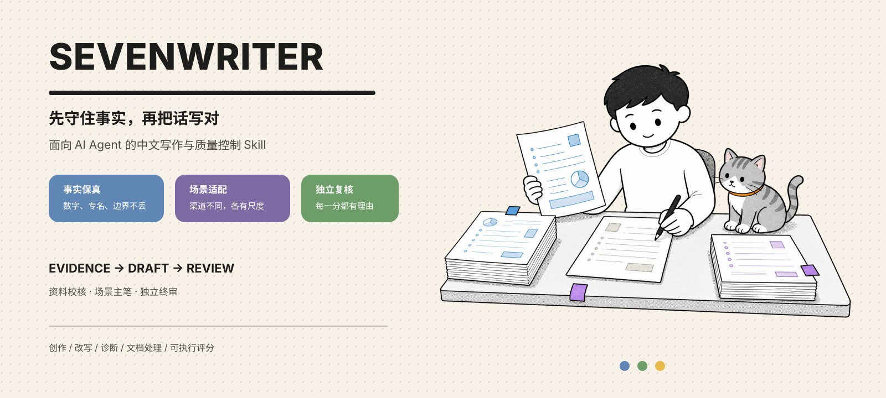

  

  <strong>SevenWriter</strong> 
  面向 AI Agent 的中文写作、改写、诊断与质量控制 Skill

SevenWriter 不把“去 AI 味”理解成删几个词、故意写错字或追着检测器分数跑。它先确认任务和场景，锁住事实、数字、专名、引用、链接与承诺边界，再处理结构、语气、节奏和文风。

它既能改已有文案，也能在你不知道怎么写时，根据材料从零起稿。每份成稿都可以继续接受同一套保真检查、场景评分和独立复核。

## 先看一个例子

原稿：

> 您好，这边已经和财务同事再次确认过了，预计明天下午会给到您明确反馈。感谢您的理解与支持，如有任何问题请随时联系我们。

如果任务只是“轻改，保留礼貌和联系入口”，SevenWriter 不会为了显得简短而删掉有用内容：

> 您好，我们已经再次和财务确认，预计明天下午给您明确反馈。感谢您的理解，如有其他问题，也可以随时联系我们。

这里保留了“财务”“预计”“明天下午”和继续联系的入口，只压缩重复表达。原稿如果已经更适合当前关系和渠道，也可以原文胜出。

## 它解决的不是一种文风

- 客户催进度、售后、退款、物流与面试跟进
- 邮件、微信短消息、社群通知、朋友圈文案
- 产品推荐、网站介绍、公众号与自媒体长文
- 小红书、社交帖子、抖音与快手口播
- SEO、GEO、博客、播客、周报、PPT 与演讲稿
- Markdown、Word 长文和跨章节一致性检查
- 学术写作、协议、游戏文案与合规风险提示
- 基础纠错、正式写作、可读性优化、地道表达与适度口语化

场景不同，“自然”的标准也不同。客户回复需要清楚和克制，朋友圈要符合真实关系，演讲稿要能朗读，SEO 要先回答搜索意图，学术文本则不能为了顺口改坏术语或证据边界。

## 九层工作流

SevenWriter 依次完成九件事：确认任务与场景、建立内容契约、诊断写作问题、加载场景规则、匹配作者文风、生成最少必要候选、执行七维评分、定向修复，以及长文档的一致性检查。

脚本负责定位、记录和重复执行，Agent 负责结合上下文判断。规则命中只是证据，不等于机械删除指令。

## 三人编辑部

复杂或高风险任务可以启用三人编辑部：

1. **资料校核席**先建立证据包，列出确认事实、未知项、锁定内容和待核来源。
2. **场景主笔席**是唯一正文写入者，根据证据包和场景完成成稿，并记录改了什么。
3. **独立终审席**使用新上下文复核，不查看主笔策略和自评分，给出发布或发送意见。

三席分别评分并解释原因。资料校核占 30%，主笔执行自检占 20%，独立终审占 50%；编辑部评分再以 30% 权重并入 SevenWriter 七维评分。关键事实、伦理、合规或内容契约错误可以直接否决，不能靠平均分抵消。

SEO/GEO、学术、协议、受监管主张和长文档建议启用完整三席。短消息与低风险轻改保持最小必要流程。

## 评分看什么

| 维度 | 权重 | 核心问题 |
| --- | ---: | --- |
| 事实保真 | 25 | 事实、数字、专名、引用和承诺有没有被改坏 |
| 场景适配 | 20 | 这段话是否适合当前读者、渠道和行动目的 |
| 自然度 | 20 | 表达是否像真实场景中的人，而不是模板拼接 |
| 信息密度 | 15 | 每段是否在推进信息，而不是重复和升华 |
| 文风匹配 | 10 | 是否符合作者样文或明确语体 |
| 可读性 | 5 | 句段负担、层级和指代是否清楚 |
| 模式风险 | 5 | 是否存在机械排比、空泛转折等重复模式 |

报告不只给总分。每个维度都要说明得分理由、扣分理由、文本证据和提升条件，并生成位置化修改表。GPTZero 等检测器只能作为独立、低权重的外部信号，不进入质量总分。

## 快速使用

让支持 Skill 的 Agent 读取 SevenWriter，然后像平常提需求一样说明材料、用途和必须保留的内容即可。例如：

- “使用 SevenWriter 优化这篇文章，保留标题层级、链接、数字和关键词，按 SEO 场景处理。”
- “根据这些材料写一篇公众号文章，不知道的事实不要补写，先列出待确认项。”
- “分析这份演讲稿，先不要修改，告诉我问题位置、原因和建议改法。”

完整任务会同时交付成稿副本、详细评审报告、修改清单和执行记录。需要接入生成后端或使用命令行时，再查看 [`SKILL.md`](./SKILL.md) 与 [`references/host-integration.md`](./references/host-integration.md)。

## 不同场景，分别怎么处理

### 客户进度、售后、退款、物流与面试跟进

先把当前状态说清楚，再交代下一步、负责人或下次同步时间。退款、物流和售后会区分“已受理、处理中、已完成、已到账”等不同状态，不把预计写成保证；面试跟进保持专业、明确，不虚构其他 offer，也不靠施压换回复。

### 邮件、微信短消息、社群通知与朋友圈

邮件关注称呼、关系距离、核心目的、附件、承诺和所需回复；微信短消息强调结论优先，不把一句话扩成客服话术。社群通知必须让成员马上看懂对象、时间、地点、入口和要做什么。朋友圈则根据真实关系、发布目的和可见范围调整语气，不套营销模板，也不强行感悟。

### 产品推荐、网站介绍、公众号与自媒体长文

产品推荐会说明适合谁、解决什么问题、证据来自哪里，以及价格、效果和适用限制。网站文案围绕页面任务、信息层级和真实能力组织，不使用空泛的“领先”“赋能”。公众号和自媒体长文关注标题承诺、文章主线、段落信息增量、案例来源、合作披露与文末动作，不套统一的爆款结构。

### 小红书、社交帖子与抖音/快手口播

小红书和社交帖子可以自然、具体、有个人感，但不能凭空编造“亲测”、使用经历或产品效果。短视频口播按真实朗读节奏处理开场、停顿、信息递进和结尾动作，同时核对字幕、画面与口播中的事实是否一致，不用随机短句制造节奏。

### SEO、GEO 与网页内容

一个 URL 只是内容来源，不会自动触发 SEO 或 GEO。SevenWriter 会先读取网页正文和结构，再按你明确提出的目标处理。SEO 关注搜索意图、页面结构、关键词、内部关系和信息增益；GEO 关注直接答案、实体关系、来源、更新时间、限制条件与可引用性。只有用户明确提出对应目标时才加载规则，不把两者混成模糊的“网页优化”。

### 博客、播客、周报、PPT 与演讲稿

博客强调论点推进、章节作用和作者语气；播客优先考虑听觉接收、主持与嘉宾分工、自然转场和时长。周报区分本周结果、问题、下周计划和需要协助的事项，不用忙碌感代替进展。PPT 关注单页结论、数据口径与页面衔接；演讲稿则通过完整朗读检查主线、停顿、故事、数字和现场落点。

### Markdown、Word 长文与跨章节检查

长文先建立文档地图，再逐节修改，最后核对术语、数字、引用、链接、标题层级和结论的一致性。Markdown 尽量保持原结构；Word 写入新副本，不主动覆盖源文件。复杂文本框、域代码和局部字符格式会在报告中说明限制。

### 学术、协议、游戏文案与合规风险

学术写作优先保护研究问题、方法、数据、术语、引文归属和不确定性。JCR、JIF、Web of Science 收录与中科院分区必须记录来源和年份，不能拿单一年份代替趋势；ACS 也必须落实到具体期刊、文章类型和当期作者指南。协议关注主体、定义、权利义务、期限、例外和执行条件，但不把语言润色冒充法律意见。游戏文案会核对版本、玩法、奖励、概率入口、分级与平台规则。版权、商标、广告和受监管主张只做风险识别与待确认清单，不替代专业审查。

### 纠错、去 AI 味、正式写作与表达优化

这些是可以叠加到任何场景上的能力。SevenWriter 可以修正错别字、病句、指代、重复和格式问题，也可以提高正式度、可读性、一致性与地道程度。去 AI 味不等于加入错别字、生僻词、俚语或随机长短句；口语、流行语和俚语只有在人物、品牌、年代、地区和渠道都合适时才使用。

## 想进一步了解

日常使用从 [`SKILL.md`](./SKILL.md) 开始即可。场景规则、评分方法、事实保真、三人编辑部、学术指标和检测器边界都放在 `references` 中；示例与质量案例分别保存在 `examples` 和 `benchmarks` 中。普通使用者不需要理解内部程序结构。

## 设计边界

- 不用错别字、生僻词、随机长短句或无意义口语词伪造“真人感”。
- 不机械删除礼貌表达；一句话是否保留，要看关系、渠道和实际作用。
- 不复制参考 Skill 的专有措辞、人名、人设、提示词、目录或调度配置。
- 不预测作者身份，也不承诺通过任何 AI 检测器。
- Benchmark 中的合成案例用于回归检查，不能替代脱敏后的真实案例。

## 当前验证

- 16 项运行时测试通过。
- 25 个一级场景质量案例通过结构验证。
- 核心运行时使用 Python 标准库，最低要求 Python 3.9+。

更完整的执行规则从 [`SKILL.md`](./SKILL.md) 开始阅读。
